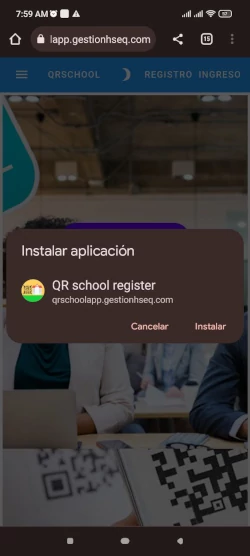
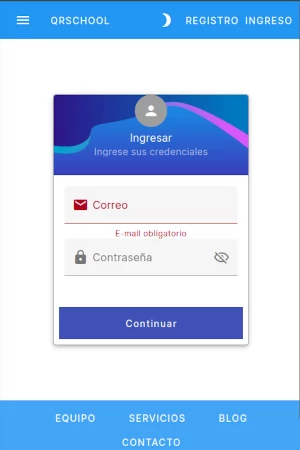

# User tutorial

This software is a progressive web application so you can run it in most devices including computer, mobile devices, also you will allways have the last version.

Please visit [QRSchool app](https://qrschoolapp.gestionhseq.com)

## Install the app in your device:

=== "Pc & laptop"

    Select "Intall Qr" button from navigation bar

    

    Select **install**

    

=== "Mobile device"

    In the menu select install option

    

    

Now you can use the app from your desktop or the main screen in your device.

# Register as a user

In the menu toolbar select "Registro"

Fill data in the formulary and then press "continuar" button

You'll be redirect to show your qr

# Login

In the menu toolbar select "Ingreso"

Fill data in the formulary and then press "continuar" button

