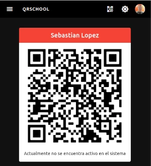

# QR code

The application give you a unique QR code identifier, this QR code will be available online and offline so once you open it it would be available even without internet connection.

???+ warning "Protect your QR code"

    This code only belogns to you so please don't allow third party people copy it,
    only show the code to trusted persons.

    In case some unauthorized copied your QR code please generate a new one.

## Display my QR code

Before you can do this operation you should be logged in, then at the top in the menu select the :material-qrcode: icon

In case you are not active in the application you should get a red card title, otherwise it will be blue ort grey

## Display my QR code in dark mode

The application allows you to switch between diferent modes (ligth and dark), to switch between modes please select the moon icon :material-moon-waxing-crescent:

???+ note "Why a white background?"
    White background color is required for some devices to correctly identify the QR code
