# Administración

Para ingresar al proyecto de administración debes de ingresar a la url
<a href="https://qrschool-selobu.pythonanywhere.com/admin/" >https://qrschool-selobu.pythonanywhere.com/admin/</a>

Luego de autenticarse aparece en el menú superior cada una de las opciones

Matrícula
=========

Menú de matrícula, es el primer paso a seguir luego de hacer la configuración inicial del proyecto,

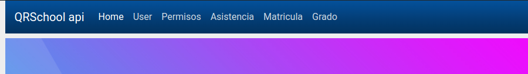

En la matrícula se encuentra unas pestañas para ver la lista de matrículas, crear una nueva matrícula y adicionar filtros.

Para crear una matrícula seleccione la opción de crear y llene los datos del formulario

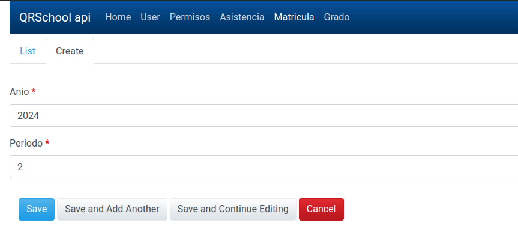

Al grabar aparece el nuevo registro

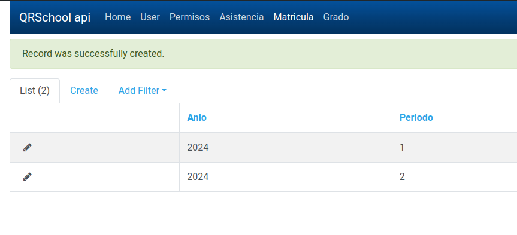

Grado
=====

Una vez registrada la matrícula proceda a registrar cada uno de los grados que tenga la institución educativa.

Están las opciones para listar las matrículas, crear, adicionar filtros.

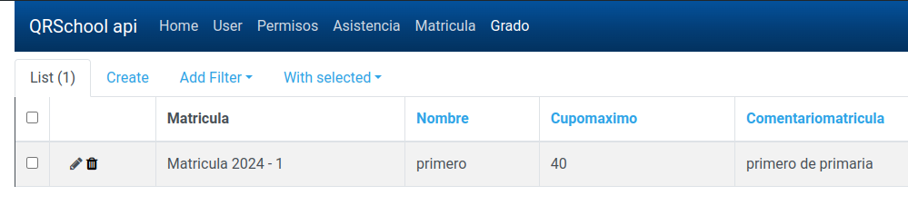

Seleccione la opción de crear y llene el formulario

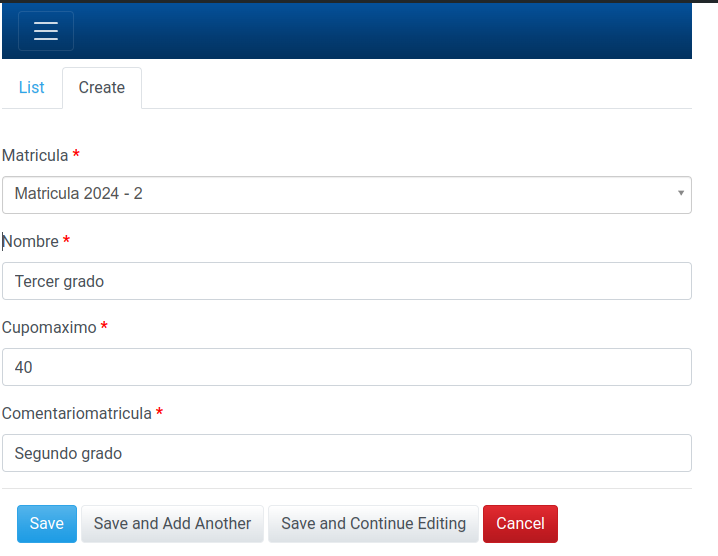

Permisos
========

Va al menú de permisos y aparecen las opciones de listar y filtrar

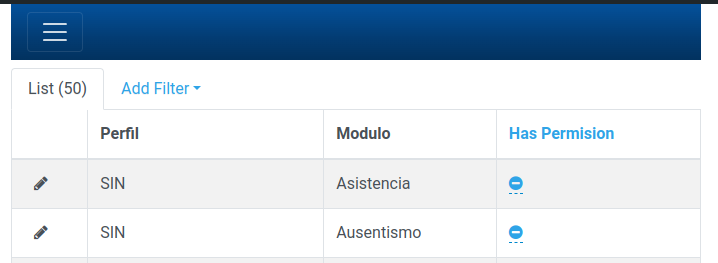

Seleccione cualquier item de la columna *Has Permision* para cambiar la opción de registrar ausentismo

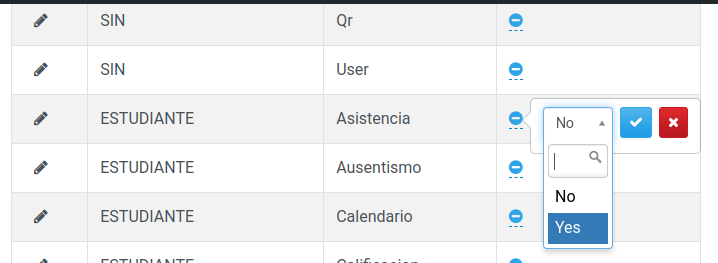

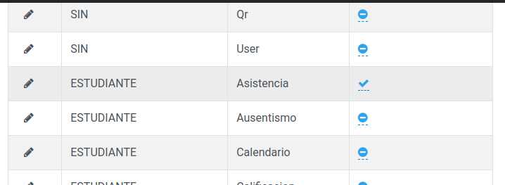

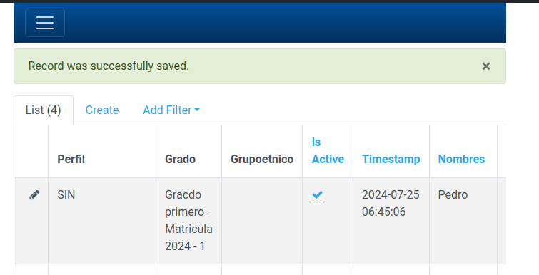

User
====

Este menú sirve para editar datos de los usuarios también para editar los perfiles.
Una vez que el usuario se registró con su dispositivo móbil el adminstrador deberá
actualizar el perfil.

???+ note "No agregue nuevos usuarios mediante esta interfase?"
    Los usuarios que agregue por este método no tendrá una contraseña asignada

Para editar el perfil de usuario deberá hacer click en el ícono de editar

Luego seleccione un perfil

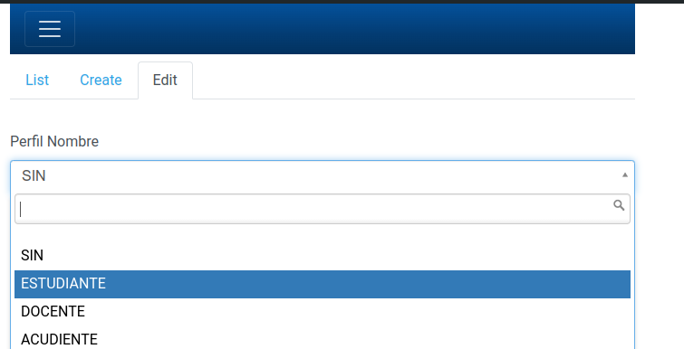

Y grabe el cambio

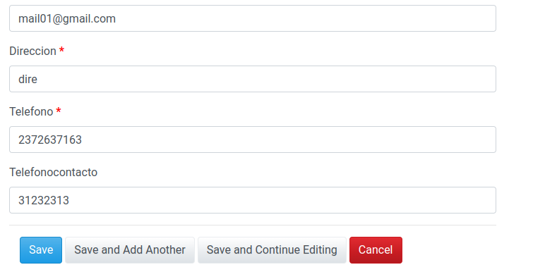

Podrá visualizar el cambio

