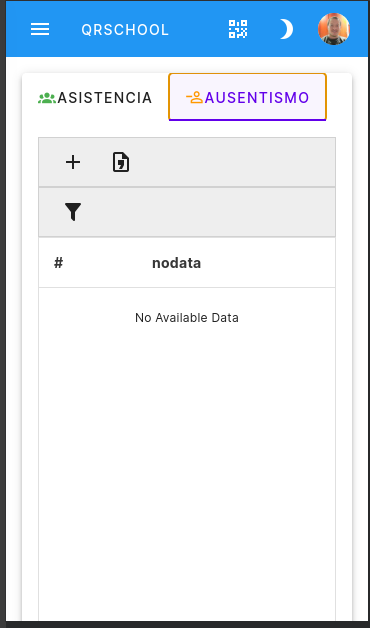
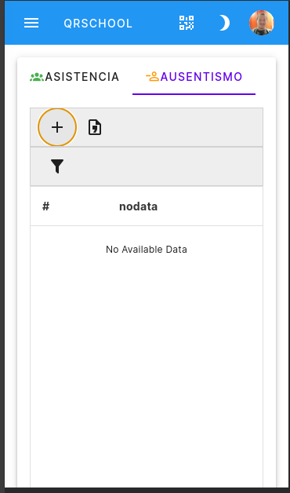
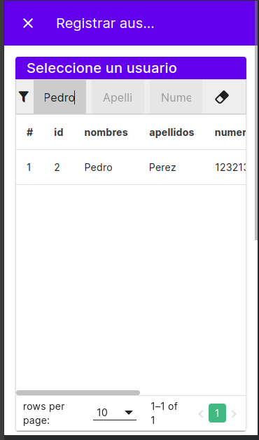
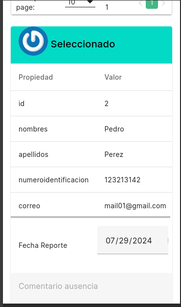
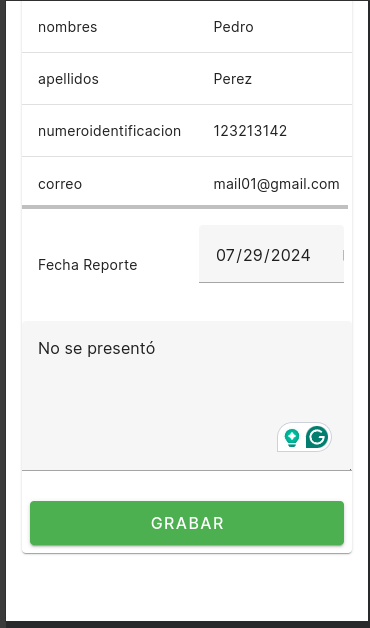
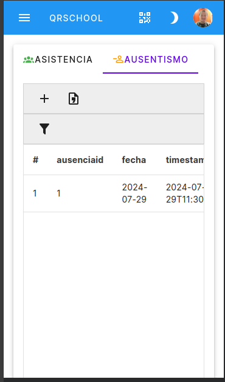
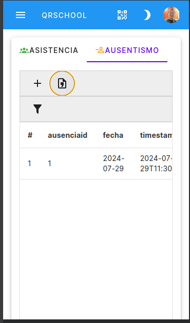
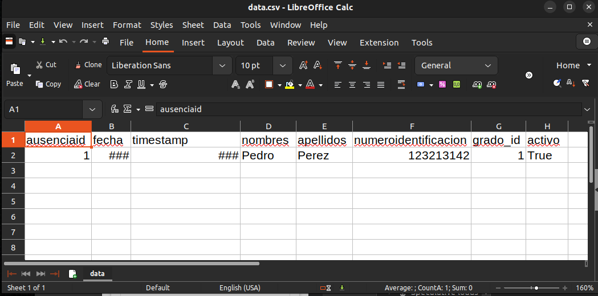

# Ausencia

Registro de ausencia de usuarios; desde el menú de asistencia te diriges a la pestaña de
ausentismo

haces click en el ícono de agregar

Se filtra el usuario que está ausente

Seleccionas la persona y te diriges hacia abajo en la  pantalla, para luegeo llenar el comentario

Y das en el botón grabar

Aparecerá el mensaje de registro exitoso

Cuando refresque la pantalla de ausentismo aparecerá el ausentismo registrado

Para exportar el listado de ausentes solo debe hacer click en el boton csv

Se puede abrir con libreoffice o MSoffice.

