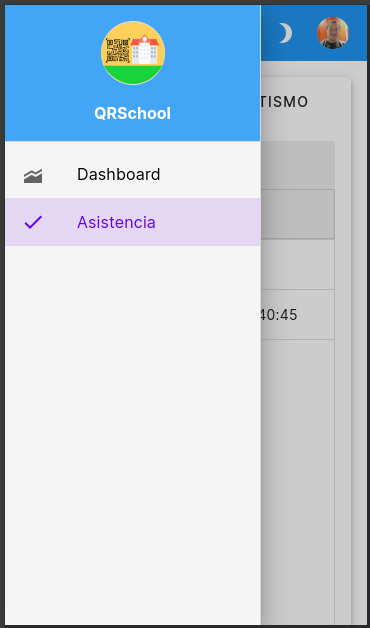
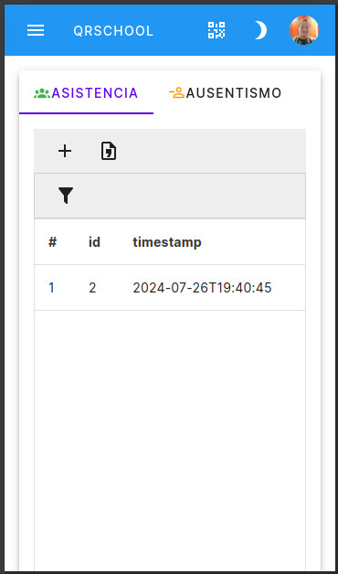
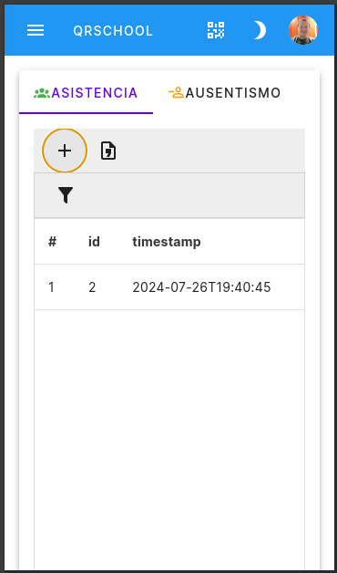
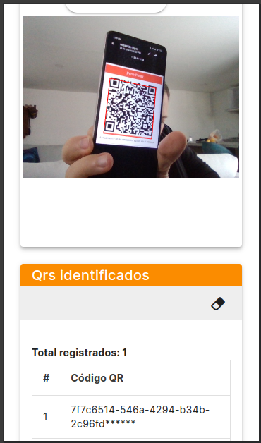
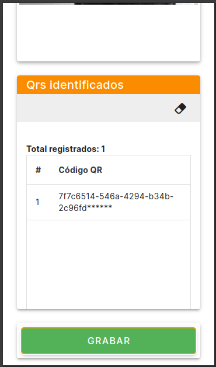
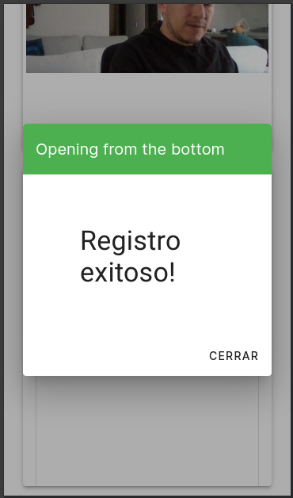
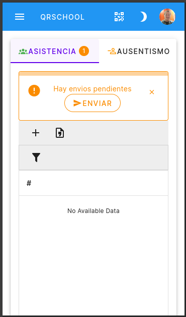
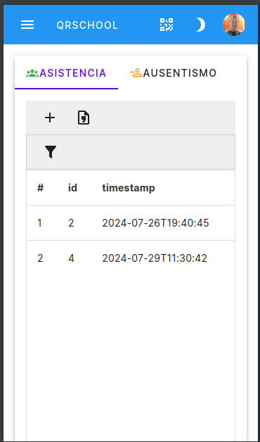
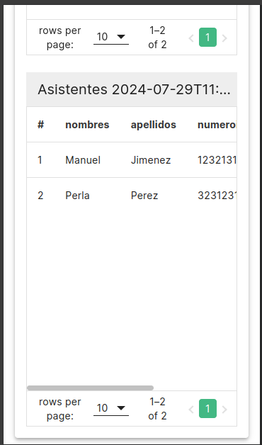

# Asistencia

Registro de asistencia

Una vez haya ingresado vas al menú y seleccionas la opción de Asistencia

Por defecto aparece el listado de asistencia actual registrado

Para agregar un nuevo usuario selecionas el boton :material-plus: y escaneas el código QR
de los usuarios a registrar

Se hace click en el boton grabar y si el registro es exitoso aparece "Registro exitoso"

En el caso que haya un problema en el registro de la asistencia aparece el emensaje de envíos pendientes.

Haga click en enviar!

Y aparecerá el nuevo registro

Para visualizar un listado de asistencia deberas de seleccionar un listado y moverte hacia la parte inferior de la pantalla, allí aparecerá los asistentes.

???+ warning "refrescar el contenido"

    Los listados de asistencia no se reflejan inmediatamente en la pantalla, esto es debido al manejo de buffers y el tiempo por defecto.

