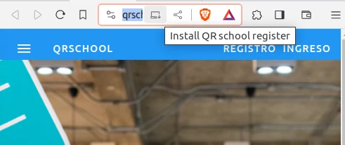
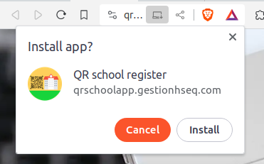
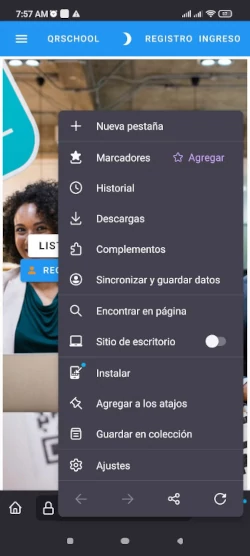
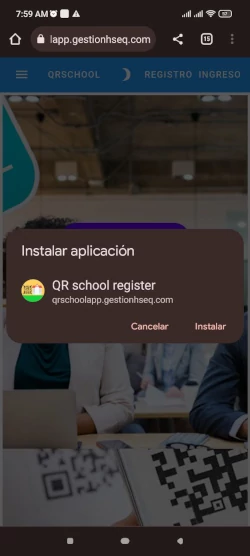
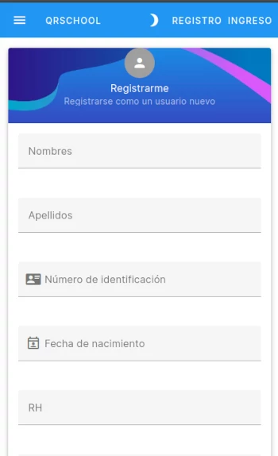
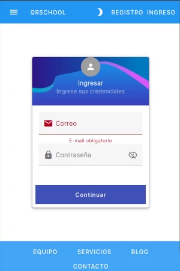

# Usuario

Este software es una aplicación web progresiva, por lo que puede ejecutarlo en la mayoría de los dispositivos, incluidos computadoras, dispositivos móviles, también siempre tendrá la última versión.

Por favor visite [QRSchool app](https://qrschoolapp.gestionhseq.com)

## Instalar la aplicación en tu dispositivo:

=== "Pc & laptop"

    Seleccione el boton "Intall Qr" desde el menú de navegacion

    

    Seleccione **install**

    

=== "Dispositivo mobil"

    En el menú, seleccione la opción de instalar

    

    

Ahora puedes utilizar fácilmente la aplicación desde la pantalla principal o desde tu dispositivo móbil.

# Registrar un usuario

En la barra de herramientas seleccione el boton "Registro"

Llene los campos de formulario y presione continuar "continuar"

Seras redireccionar hacia un código QR, este valor que aparece inicilamente es inválido hasta que ingrese nuevamente,
mirar el siguiente item.

# Ingresar

Desde la barra de herramientas seleccione el boton "Ingreso"

Llene el formulario y presione "continuar".

