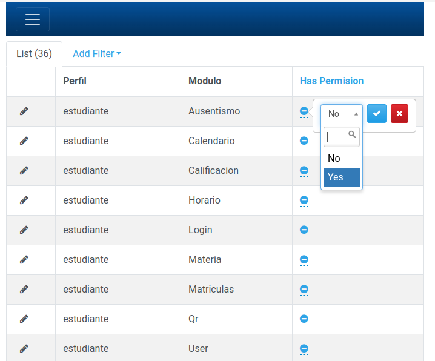

# Perfiles

Actualmente existen los siguientes perfiles:

- ESTUDIANTE
- DOCENTE
- ACUDIENTE
- ADMINISTRADOR

El acceso a los módulos deben otorgarse mediante el uso de la herramienta de administración en
https://**yourprojectdomain**/admin. En el caso de la demostración está en [https://qrschool-selobu.pythonanywhere.com/admin/](https://qrschool-selobu.pythonanywhere.com/admin/)

## Permisos

Antes de que los usuarios puedan interactuar con la aplicación, debe configurar los permisos Mediante el punto de conexión de administración de API
`<baseroot>/admin/perfilmodulolnk/`

Con la interfaz web proporcionada, puede actualizar los permisos del perfil

Esos permisos se actualizan inmediatamente.
