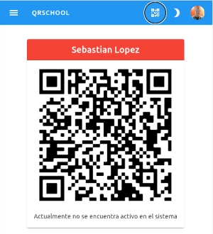
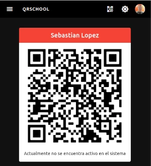

# Código QR

La aplicación le da un identificador de código QR único, este código QR estará disponible en línea y fuera de línea, por lo que una vez que lo abra, estará disponible incluso sin conexión a Internet.

???+ warning "Proteja su código QR"

    Este código solo te pertenece a ti, así que no permitas que terceros lo copien, Muestre el código solo a personas de confianza.

    En caso de que alguien no autorizado haya copiado su código QR, genere uno nuevo.

## Mostrar mi código QR

Antes de poder realizar esta operación, debe iniciar sesión, luego, en la parte superior del menú, seleccione el icono :material-qrcode:

En caso de que no esté activo en la aplicación, debe obtener un título de tarjeta roja, de lo contrario, será azul o gris.

## Mostrar mi código QR en modo oscuro

La aplicación le permite cambiar entre diferentes modos (claro y oscuro), para cambiar entre modos, seleccione el icono de la luna :material-moon-waxing-crescent:

???+ note "Por qué fondo blanco?"
    El color de fondo blanco es necesario para que algunos dispositivos identifiquen correctamente el código QR
